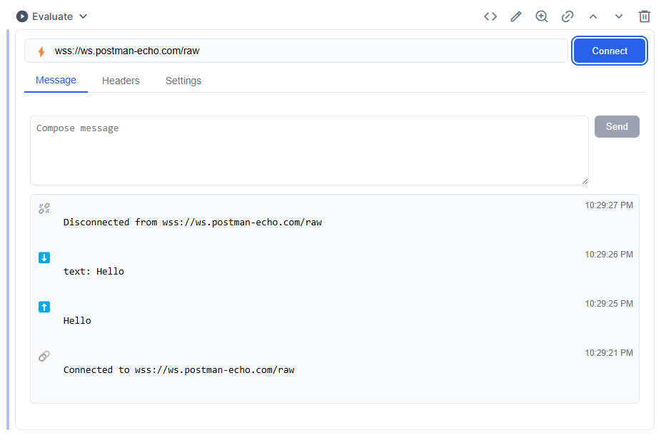

# Kino.WebSocket

A simple smart cell for Kino that allows you to connect to a WebSocket server and send/receive messages.

## Installation

The package can be installed by adding `kino_websocket` to your list of dependencies in `mix.exs`:

```elixir
def deps do
  [
    {:kino_websocket, github: "chgeuer/kino_websocket"}
  ]
end
```

I'm not sure if this package will be published to Hex.pm, so for now you can just clone the repo and use it directly. Other smart cells like [merquery](https://github.com/acalejos/merquery) are much cleaner with respect to views and state management, while this one is currently a hot JavaScript mess 🙄.

### Screenshot



### Animation


