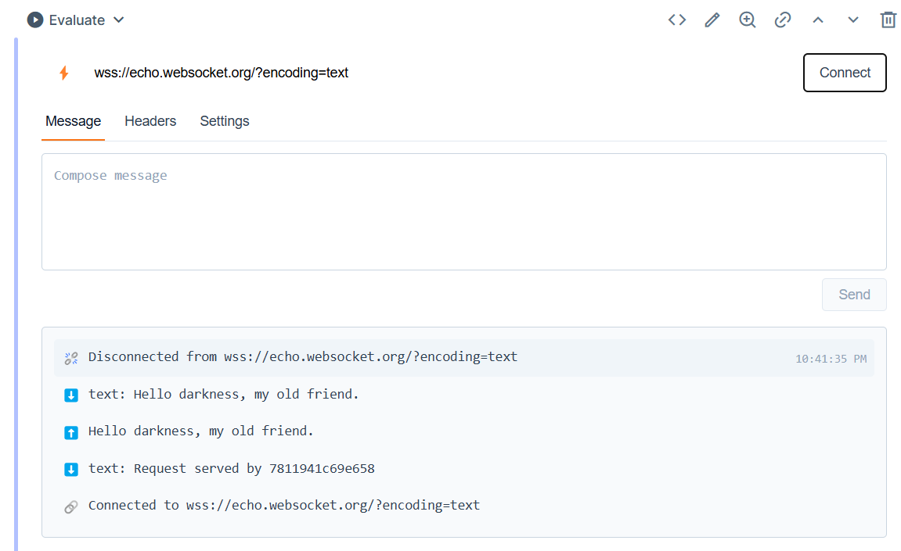

# Kino.WebSocket

A simple smart cell for Kino that allows you to connect to a WebSocket server and send/receive messages.

To use this, you need to install [Livebook](https://livebook.dev/) on your computer, create a new notebook, add this library (`{:kino_websocket, github: "chgeuer/kino_websocket"}`) to the dependencies, and add the "WebSocket Client" smart cell. 



## Installation

The package can be installed by adding `kino_websocket` to your list of dependencies in the `Mix.install/2` task:

```elixir
Mix.install([
  {:kino_websocket, github: "chgeuer/kino_websocket"}
])
```

I'm not sure if this package will be published to Hex.pm, so for now you can just clone the repo and use it directly. Other smart cells like [merquery](https://github.com/acalejos/merquery) are much cleaner with respect to views and state management, while this one is currently a hot JavaScript mess 🙄.

### Demo GIF


